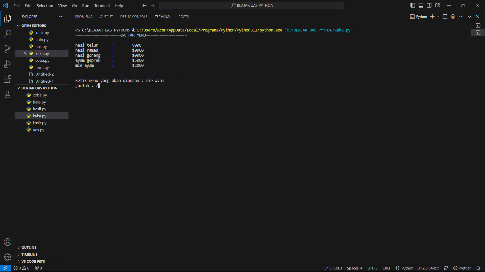
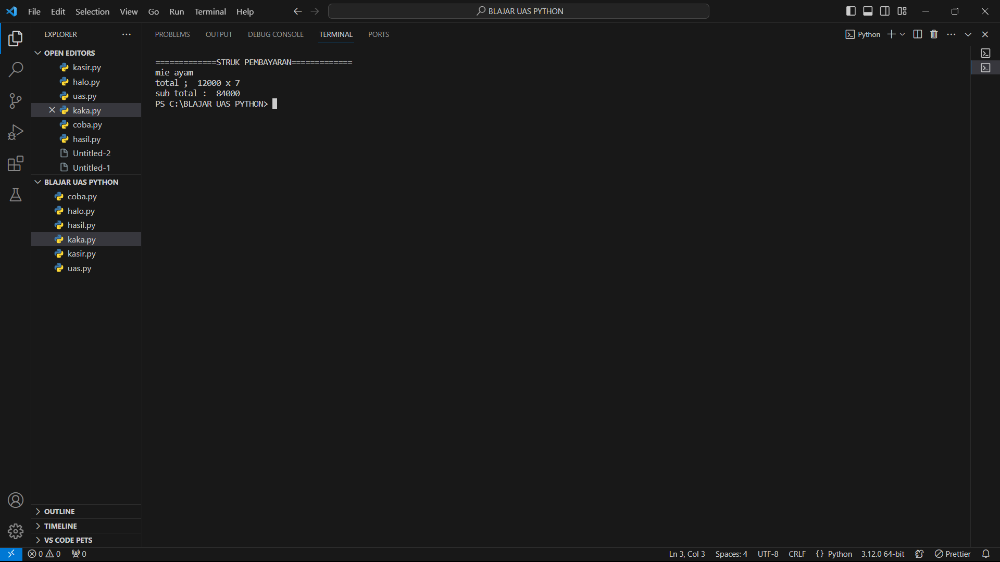

# membuat mesin kasir

### data
```python
from os import system
menu = {
    "\tnasi telur": 8000,
    "\tnasi rames": 10000,
    "\tnasi goreng": 10000,
    "\tnasi ayampecel": 15000,
    "\tayam geprek": 15000,
    "\tsoto\t": 10000,
    "\tmie ayam": 18000,
}
```
### untuk daftar menu
```python
print("                                              ")
print("==================DAFTAR MENU==================")
print("                                              ")
for i in menu:
    print(i, "\t:\t", menu[i])
print(" ")
print("=======================================")
```
### untuk user melakukan input pembelian
```python

beli = input("pilih menu makanan : ")
jumlah = int(input("jumlah : "))
bayar = jumlah * menu
system("cls")
```
### struk
```python
print("===========STRUK PEMBAYARAN===========")
print("menu yang dipesan : ", beli)
print("harga             : ", menu[i], "x", jumlah)
print("total             : ", bayar)
print("======================================")
```
### hasil


### setelah user menginput\memesan makanan


